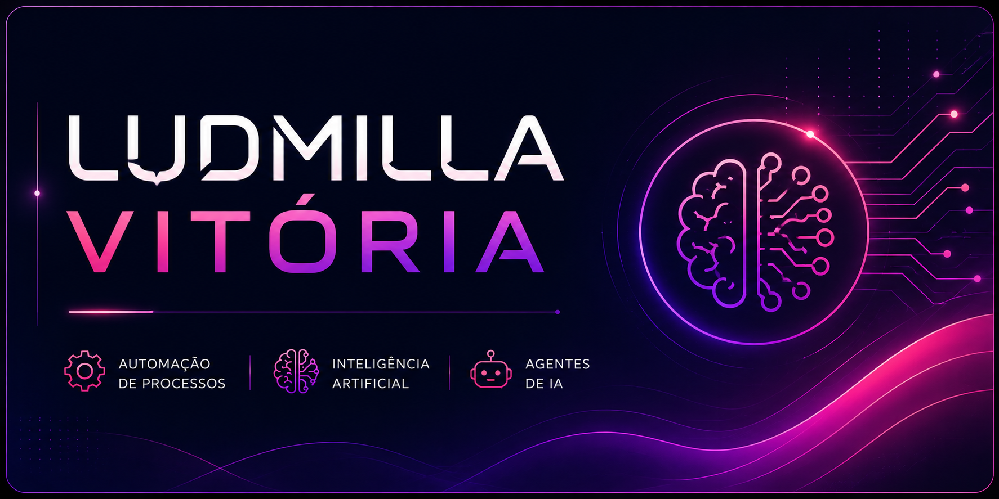

<p align="center">
  
</p>
<div align="center">

[](README.md)
[](README-EN.md)

<br>


---

## 💜 Sobre mim

Olá! Eu sou a **Ludmilla Vitória**. 👋

Estou desenvolvendo minha atuação profissional na área de **Automação de Processos e Inteligência Artificial**, com foco na criação de soluções que ajudem empresas a simplificar processos, melhorar o atendimento e otimizar operações.

Atualmente, transformo meus estudos em **projetos práticos**, principalmente nas áreas de agentes de IA e automação para negócios.

> 🩷 **Tecnologia aplicada a problemas reais, com foco em soluções simples, eficientes e inteligentes.**

---

## 🤖 Automação & Inteligência Artificial

### 🤖 Agentes de IA
Desenvolvimento de agentes inteligentes para atendimento, suporte e automação de tarefas.

### 💜 Automação de processos
Criação de fluxos para reduzir tarefas manuais, organizar processos e aumentar a eficiência.

### 🩷 Automação de atendimento
Soluções para pré-atendimento, organização de contatos e comunicação com clientes.

### 💜 Integrações
Conexão entre ferramentas para criar fluxos automatizados.

### 🩷 Engenharia de prompts
Criação, teste e aperfeiçoamento de instruções para sistemas de Inteligência Artificial.

---

## 🛠️ Tecnologias & Ferramentas

<div align="center">


</div>

> 📚 Algumas das tecnologias apresentadas fazem parte do meu processo atual de aprendizado e desenvolvimento profissional.

---

## 🚀 Projeto em destaque

### 💜 AF Automation

> 🤖 **Automação + Inteligência Artificial para negócios**

Projeto dedicado ao desenvolvimento de soluções de **automação e inteligência artificial para empresas**.

**Principais áreas:**

`🤖 Agentes de IA` • `⚙️ Automação` • `💬 Atendimento` • `🔗 Integrações`

<br>


🔗 [Conhecer o projeto AF Automation](https://github.com/ludmillavitoria72-tech/af--automation)

---

## 📚 Atualmente estudando

```text
╭────────────────────────────────────────╮
│           SYSTEM LEARNING...           │
├────────────────────────────────────────┤
│ ✓ Agentes de Inteligência Artificial   │
│ ✓ Engenharia de prompts                │
│ ✓ Automação de processos               │
│ ~ JavaScript                           │
│ ~ Node.js                              │
│ ~ Integração entre ferramentas         │
╰────────────────────────────────────────╯

STATUS: EM EVOLUÇÃO 🚀
